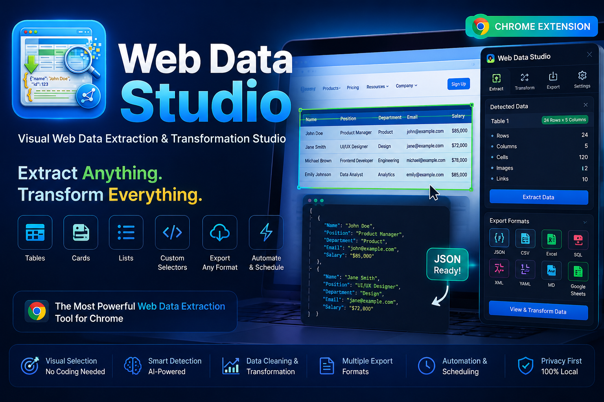
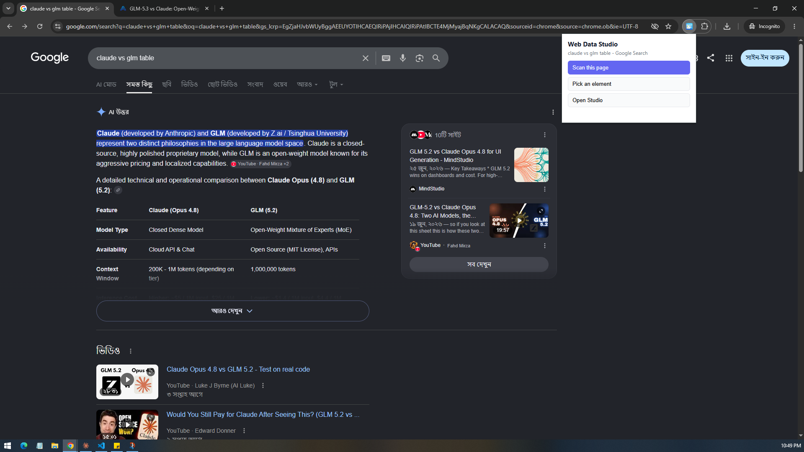
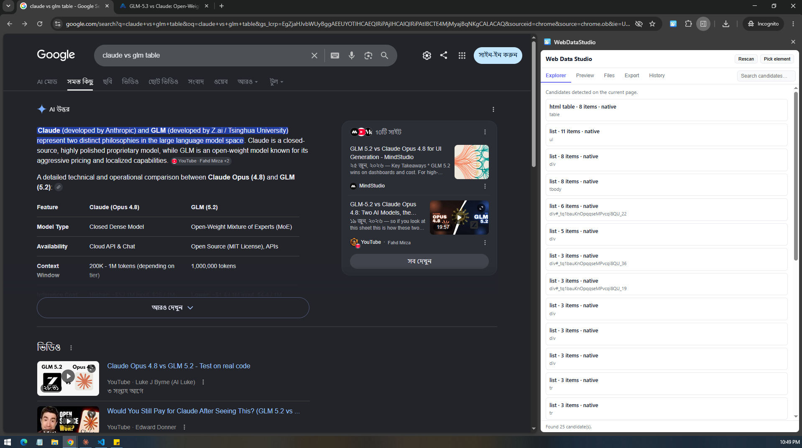
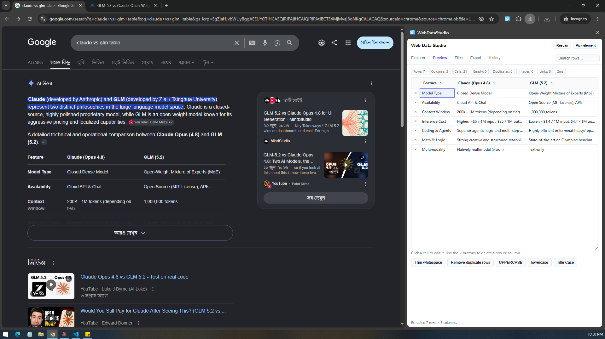
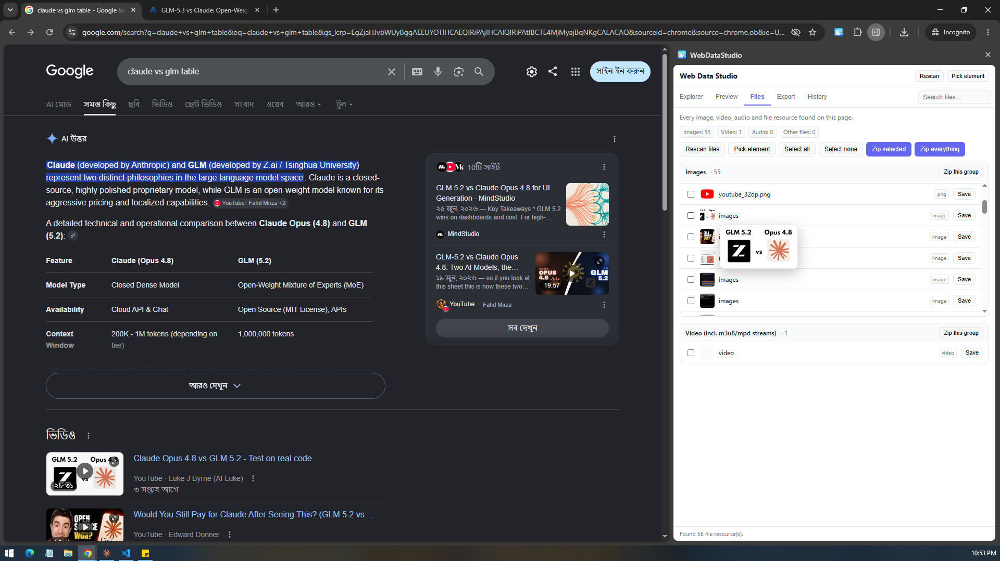
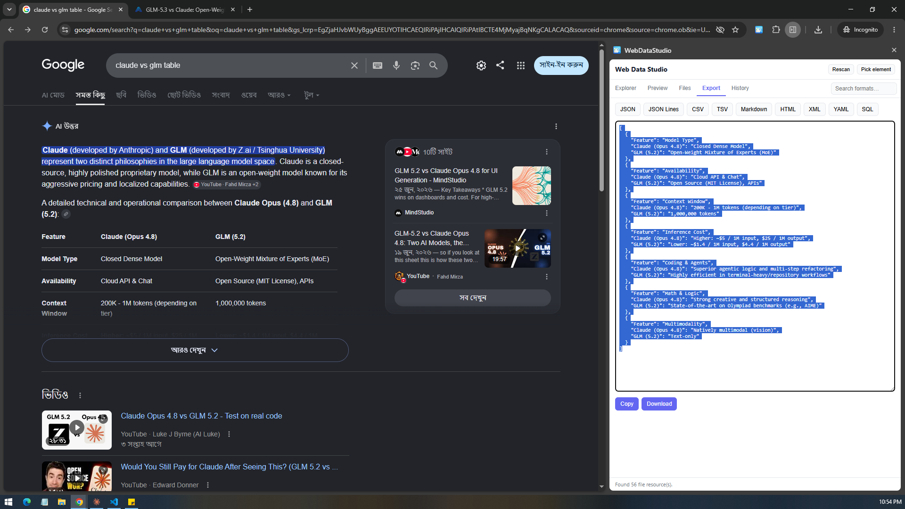
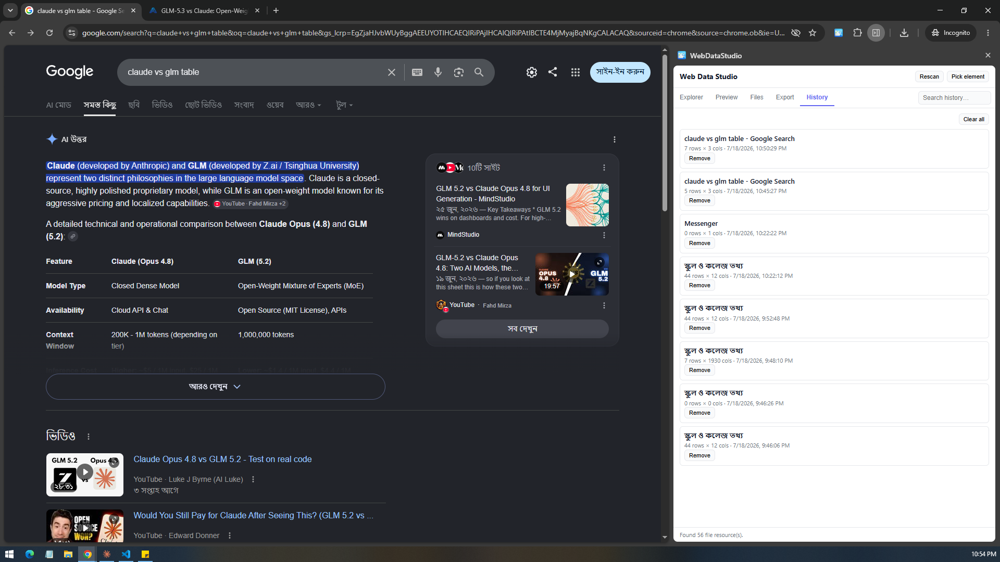

# 🧩 Web Data Studio

**A visual web data extraction & transformation platform for Chrome — pick, preview, clean, and export data from any page.**

Detect tables, cards, lists and grids on any website, preview them in a live editable table, clean and reshape the data, and export it in the format you need — JSON, CSV, TSV, Markdown, HTML, XML, YAML or SQL. Bulk-download every image, video and audio file on a page as a zip. All local, no server, no tracking.

<p align="center">
  
</p>

<p align="center">
  
  
  
  
</p>

---

## 🎬 Demo

<p align="center">
  
</p>

🎥 **Full feature walkthrough:** [Watch the video](docs/videos/full-feature-walkthrough.mp4) <!-- swap this for a YouTube link if you host it there instead -->

---

## 📸 Screenshots

<!-- Drop screenshots into docs/images/ and reference them below -->

| Popup | Explorer | Preview & Cleaning |
|---|---|---|
|  |  |  |

| Files / Resource Extractor | Export Studio | History |
|---|---|---|
|  |  |  |

---

## ✨ Features

### 🔍 Smart Detection
- Scans the page and surfaces candidate data blocks automatically — native `<table>` elements, semantic lists, and repeated card/grid patterns built from plain `<div>`s.
- Structural-similarity heuristic groups "same-shape" sibling elements to catch card grids, product listings, and search results that don't use semantic markup.
- Recognizes popular grid/table libraries by their DOM fingerprints, including **AG Grid, Tabulator, Handsontable, Kendo Grid, DataTables, Bootstrap Table, PrimeVue, Vuetify, Element Plus, Ant Design,** and **MUI**.

### 🎯 Visual Element Picker
- Chrome DevTools–style inspector overlay — hover to highlight, click to select any element directly on the page.
- Works from the popup, the side panel, or the `Ctrl+Shift+P` shortcut.

### 📋 Live Preview & Data Cleaning
- Selected data opens in an editable preview table — click any cell to edit it, delete rows/columns inline.
- One-click cleaning operations: **trim whitespace**, **remove duplicate rows**, **UPPERCASE / lowercase / Title Case**.
- Automatic type inference across extracted columns.

### 🖼️ File & Resource Extractor
- Finds every image, video, audio, and downloadable resource on the page, grouped and previewable.
- Select individual files or select-all, then **zip and download** the selection (or the entire set) using an in-browser ZIP build — no server round-trip.

### 📤 Export Studio
- Export any extraction to **JSON, JSON Lines, CSV, TSV, Markdown, HTML, XML, YAML, or SQL** (`INSERT` statements).
- Live export preview pane with one-click **copy** or **download**.

### 🕘 History
- Every extraction is saved locally so you can revisit or re-export past sessions without re-scanning the page.

### ⌨️ Keyboard Shortcuts & Commands
| Shortcut | Action |
|---|---|
| `Ctrl+Shift+D` | Open Web Data Studio |
| `Ctrl+Shift+P` | Toggle element picker |
| `Ctrl+Shift+E` | Quick export last extraction |

### 🧱 Architecture
- **Manifest V3** with a background service worker, content script, popup, and a dockable **Chrome Side Panel** UI.
- Strict TypeScript across a modular `core/` (detection, extractors, selectors, transform, exporters, storage) — no framework runtime, just Vite + vanilla TypeScript + ES modules.

---

## 🗺️ Roadmap

Web Data Studio is under active development. Planned for upcoming releases:

- Automation Studio (auto-refresh, DOM-change watching, scheduled/batch extraction across tabs)
- Workspace manager — saved selectors, extraction templates, and transformation presets
- Advanced Data Transformation Studio (calculated columns, regex transforms, custom JS pipelines)
- JSON Studio — schema, TypeScript/Java/C#/Python/Dart model generation, OpenAPI export
- Plugin system for custom extractors, exporters, and transformers
- AI-assisted header detection, table recognition, and data cleaning
- Excel / ODS export, MongoDB / PostgreSQL / MySQL export targets

Contributions and ideas toward this roadmap are very welcome — see [Contributing](#-contributing).

---

## 📦 Installation (Developer Mode)

Stable builds are published as a ready-to-use `dist.zip` on the **[Releases](../../releases)** page — no build step required.

1. Go to the [Releases](../../releases) page and download `dist.zip` from the latest tag.
2. Unzip it — you'll get a folder containing `manifest.json`, `popup.html`, `sidepanel.html`, etc.
3. Open `chrome://extensions` in Chrome.
4. Enable **Developer mode** (top-right toggle).
5. Click **Load unpacked** and select the unzipped folder.
6. Pin the extension and click the icon, or press `Ctrl+Shift+D`, to open Web Data Studio.

---

## 🛠️ Development

Requires Node.js 18+.

```bash
# install dependencies
npm install

# start the dev build (watches src/ and rebuilds into dist/)
npm run dev

# type-check + production build into dist/
npm run build

# lint
npm run lint

# format
npm run format
```

After building, load the generated `dist/` folder as an unpacked extension via `chrome://extensions` → **Load unpacked**.

### Project structure

```
src/
├── background/     # MV3 service worker
├── content/        # Content script, element picker overlay, resource detectors
├── popup/          # Toolbar popup UI
├── sidepanel/      # Main Studio UI (Explorer, Preview, Files, Export, History)
└── core/
    ├── detection/   # Table/list/card/grid + library detection
    ├── extractors/  # Table & repeated-pattern extractors, type inference
    ├── selectors/   # CSS selector generation, element description
    ├── transform/   # Safe expression engine for transformations
    ├── exporters/   # JSON, CSV, TSV, Markdown, HTML, XML, YAML, SQL
    ├── storage/     # Local extraction history
    └── utils/
```

---

## 🤝 Contributing

Issues and pull requests are welcome. If you're adding a new exporter, detector, or transformation, keep it dependency-free and in strict TypeScript, consistent with the existing `core/` modules.

## 📄 License

[MIT](LICENSE)
